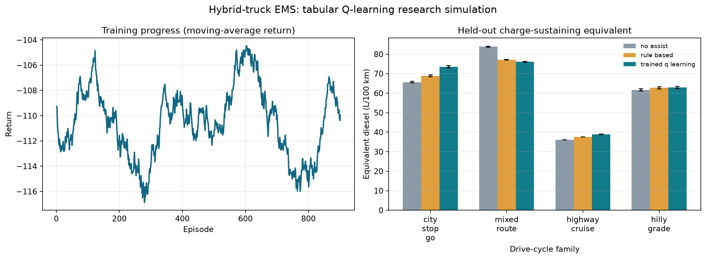

# Efficient and Sustainable Multi-Agent EMS for a Heavy-Duty Hybrid Truck

This project studies a multi-agent energy management strategy for a heavy-duty hybrid truck. The design is inspired by the electrification work associated with a heavy-vehicle context, with the goal of managing engine and motor power so that the truck remains efficient, safe, and durable across realistic operating conditions.

The system is organized around a layered control architecture in which a supervisory planner interprets the mission, the powertrain policy manages engine and motor torque split, the battery-health controller constrains charge and discharge, and the performance layer evaluates energy use, thermal stress, regenerative recovery, and long-term sustainability. The workflow is intentionally modular so it can be extended toward stronger RL or MPC-based optimization without sacrificing transparency or explainability.

## 1. Research framing

Heavy-duty hybrid trucks operate under very different constraints from passenger vehicles. Long mission durations, variable road grade, high transient torque demands, and the cost of battery degradation mean that energy management must balance efficiency, durability, thermal safety, and driver comfort in a coordinated way.

This repository proposes a multi-agent control structure designed for that challenge. Rather than relying on a single rule set, the decision problem is divided into specialized agents that work toward a common objective. That structure makes the project more suitable for research communication, benchmarking, and further extension toward policy optimization.

## 2. Control architecture

The system is composed of the following layers:

- Mission and safety supervisor: defines strategic objectives, safe SoC boundaries, and regenerative priorities.
- Powertrain coordination policy: allocates engine torque and motor support while respecting efficiency and driver demand.
- Battery health and thermal protection: limits charging and discharging under degradation and temperature constraints.
- Driver-assistance layer: translates the final decision into smooth and understandable guidance for the operator.
- Performance and benchmark layer: evaluates reward, thermal safety, fuel efficiency, and sustainability across missions.

This layered logic keeps the controller readable while preserving a realistic multi-agent structure.

## 3. Trained RL prototype

The repository includes reproducible tabular Q-learning in `src/multi_agent_ai/rl_training.py`. This is distinct from `DeepRLEMSPolicy`, which remains a legacy hand-coded heuristic and is **not** a learned model. The learned Q table selects bounded supervisory motor-assist/regen and electric-axle gear actions; the driver-selected truck gear is not an EMS action.

Training randomizes initial SoC, battery temperature, ambient conditions, and four duty-cycle families (city stop-go, mixed route, highway cruise, and hilly grade). The reward charges fuel use, battery-energy change on a diesel-equivalent basis, battery throughput, thermal stress, and unmet traction demand, avoiding battery depletion as a free apparent fuel saving. Held-out evaluation uses fixed seeds distinct from training and includes a transparent rule controller and no-assist comparator.

The bundled plant is an explicit low-order research simulation with nominal parameters, not a calibrated Sisu digital twin. Fuel numbers are simulator estimates, not measurements from a truck. See [the model and validation caveats](docs/MATLAB_SIMULATION.md#scope-and-safety).

### Train and reproduce

```powershell
python -m pip install -e . pytest
python -m pytest -q
python -m multi_agent_ai.rl_training --episodes 1000 --seed 2026
```

The run saves the portable model, metadata, training history, per-episode benchmark results, summary, and plot under `artifacts/`. Use `python -m multi_agent_ai.rl_training --evaluate-only` to re-evaluate the saved Q table without training.

## 4. Benchmarking and public performance view

The benchmark suite compares trained Q-learning, a transparent rule baseline, and engine-only/no-assist operation on representative truck missions:

- city stop-and-go driving,
- mixed urban/highway operation,
- sustained highway cruise,
- hill-climb and grade-heavy routes.

Evaluation uses ten fixed held-out seeds per duty-cycle family. The summary reports raw simulator diesel consumption, charge-sustaining fuel-equivalent consumption, SoC change, regenerative energy, and return. Results are generated by the training command and saved to CSV rather than hard-coded into documentation.

### Current reproducible run

The checked-in artifact set was generated with tabular Q-learning, 1,000 episodes, seed 2026, 120 steps per training episode, and ten held-out seeds per scenario. The table shows mean charge-sustaining equivalent diesel consumption; values are model outputs, not vehicle-test data.

| Scenario | No assist (L/100 km) | Rule baseline (L/100 km) | Trained Q-learning (L/100 km) |
|---|---:|---:|---:|
| City stop-go | 65.66 | 68.82 | 73.54 |
| Mixed route | 83.81 | 77.12 | 76.10 |
| Highway cruise | 36.11 | 37.58 | 38.96 |
| Hilly grade | 61.71 | 62.72 | 62.88 |

On this fixed-seed run, Q-learning did **not** outperform the rule baseline consistently. Treat this as an early learning baseline and a useful negative/diagnostic result, not evidence of an efficiency gain. Re-run the documented command after any model or training-code changes; regenerated CSVs are the authoritative results.

### Visual outputs

The repository includes the following plots:

- `performance_dashboard.png` for the time-series trajectory of reward, SoC, and inverter temperature.
- `benchmark_dashboard.png` for the current trained-Q held-out comparison across benchmark scenarios.
- `artifacts/rl_training_results.png` for the Q-learning learning curve and held-out charge-sustaining benchmark.
- `artifacts/evaluation_summary.csv` and `artifacts/evaluation_episodes.csv` for aggregate and per-rollout metrics.
- `artifacts/q_policy.csv` and `artifacts/q_policy_metadata.json` for the trained policy and training/model metadata.



These images show the system’s operational behavior in a format suitable for GitHub presentation and project reporting.

## 5. How to run the project

From the repository root:

```powershell
cd "c:\Users\kwsha\OneDrive - University of Oulu and Oamk\MVD\Multi-agent AI\Oct 4"
.\venv\Scripts\python -m multi_agent_ai.main
```

Or, with the environment active:

```bash
python -m multi_agent_ai.main
```

To run the validation tests:

```bash
python -m pytest -q
```

For MATLAB, see [docs/MATLAB_SIMULATION.md](docs/MATLAB_SIMULATION.md). The MATLAB script calls the Python reference simulation, exports a CSV rollout, and plots it; it is not a Simulink plant or hardware-in-the-loop run.

To run it through VS Code Copilot, configure the local MathWorks MCP connection as described in that guide and select the workspace agent [MATLAB Simulation Engineer](.github/agents/matlab-simulation.agent.md). MATLAB R2024b execution of the rollout was verified on the development PC; MATLAB runs remain software simulations, not vehicle tests.

## 6. Repository structure

- `src/multi_agent_ai/agents.py` — EMS logic, benchmark suite, reward model, and multi-agent orchestration
- `src/multi_agent_ai/rl_training.py` — randomized drive-cycle plant, Q-learning, model export, and evaluation
- `src/multi_agent_ai/main.py` — simulation and benchmark runner
- `src/multi_agent_ai/__init__.py` — public package exports
- `tests/test_multi_agent_ai.py` — validation tests
- `performance_dashboard.png` — time-series result plot
- `benchmark_dashboard.png` — multi-policy benchmark comparison
- `artifacts/` — trained Q table, metadata, held-out results, learning plot, and rollout records
- `matlab/run_trained_ems.m` — MATLAB launcher and plotter for a Python rollout
- `.github/agents/matlab-simulation.agent.md` — Copilot role for unattended, bounded MATLAB simulation tasks
- `docs/MATLAB_SIMULATION.md` — setup, training, MATLAB, and model-scope instructions
- `scripts/github_uploader.py` — repository upload helper

## 7. Scientific background and literature context

The project sits at the intersection of hybrid vehicle energy management, battery-aware control, and multi-agent optimization. The design is informed by research in electrified powertrains and coordinated control for complex energy systems.

### 7.1 Multi-agent coordination for complex control problems

A large part of the difficulty in hybrid vehicle control comes from the fact that efficiency, safety, thermal limits, and battery health are tightly coupled. Multi-agent coordination is therefore a natural design choice for decomposing the problem into manageable control objectives.

Busoniu, Babuška, and De Schutter (2008) provide a core reference for the multi-agent reinforcement learning landscape, while also motivating the high-level organization used in this repository.

### 7.2 Hybrid energy management and power-split control

Hybrid trucks require a coordinated strategy that balances fuel use, power delivery, and battery state management. The literature on hybrid-electric vehicle energy management remains highly relevant because it establishes the conceptual foundation for torque allocation, energy recovery, and operating-window constraints.

Borhan et al. (2012) showed how model predictive control can coordinate engine and motor actions under powertrain constraints, while Tie and Tan (2013) reviewed broader energy management strategies for hybrid and fuel-cell systems. Their work informs the design of the present policy structure and the emphasis on realistic operating constraints.

### 7.3 Battery health and durability-aware control

Battery degradation is a major concern in electrified truck operation. The combination of temperature, high-rate current events, and SoC variation can materially affect service life and lifecycle cost. This is especially important in heavy-duty applications where battery replacement and material impacts are significant.

Wu et al. (2018) demonstrated the value of thermal- and health-aware energy management for hybrid electric buses. The same principle is reflected in the battery health layer of this project, which constrains charge and discharge windows and prevents aggressive cycling from dominating the policy decisions.

### 7.4 Regenerative braking and energy recovery

Regenerative braking is a central element of hybrid vehicle efficiency. When braking, a portion of the kinetic energy can be captured and stored instead of being lost as heat. This reduces mechanical brake wear and improves the energy efficiency of the vehicle mission.

### 7.5 RL and policy optimization for EMS

Reinforcement learning remains a strong direction for adaptive energy management because the task is dynamic and strongly coupled. The reward model in this project includes fuel efficiency, thermal protection, battery degradation penalties, regenerative benefit, and sustainability-aware operation, so the policy is not optimized for a single short-term objective.

The repository therefore acts as a realistic benchmark environment and research-oriented control prototype, rather than a final production controller.

## 8. Representative references

1. Busoniu, L., Babuška, R., and De Schutter, B. (2008). A comprehensive survey of multi-agent reinforcement learning. IEEE Transactions on Systems, Man, and Cybernetics, Part C: Applications and Reviews, 38(2), 156–172.
2. Borhan, H. A., Vahidi, A., Phillips, A. M., et al. (2012). MPC-based energy management of a power-split hybrid electric vehicle. IEEE Transactions on Control Systems Technology, 20(3), 593–603.
3. Tie, S. F., and Tan, C. W. (2013). A review of energy management strategies for fuel cell hybrid electric vehicles. Renewable and Sustainable Energy Reviews, 20, 82–102.
4. Wu, J., He, H., Peng, J., Li, Y., and Zhang, Y. (2018). Battery thermal- and health-constrained energy management for hybrid electric bus based on soft actor-critic. Energy, 164, 705–714.
5. Lewis, F. L., and Vrabie, D. (2009). Reinforcement learning and adaptive dynamic programming for feedback control. IEEE Circuits and Systems Magazine, 9(3), 32–50.

## 9. Project status and direction

The repository now contains a reproducible Q-learning training and held-out evaluation path in addition to its original heuristic EMS prototype. Results support software-level research comparisons only. Vehicle calibration, a high-fidelity truck plant, independent safety validation, Simulink/HIL, and hardware deployment remain future engineering work; no real-truck performance or readiness is claimed.

## 10. License

This project is intended for research, academic demonstration, and engineering experimentation.
